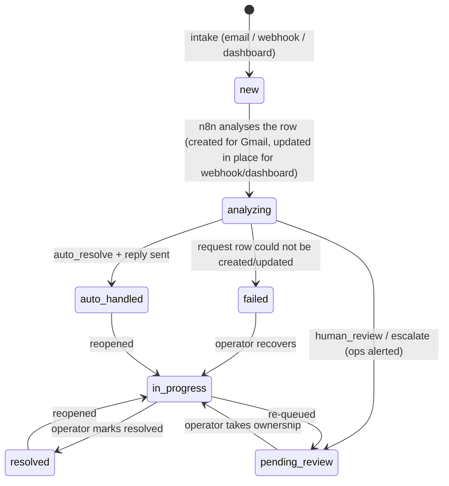

# Architecture — AI-Powered Customer Operations System

| Layer | Technology | Role |
| --- | --- | --- |
| Orchestration | n8n | Intake, AI call, routing, email sending, status writes |
| Intelligence | Claude (Anthropic) via the n8n AI Agent node | Intent/category, priority, sentiment, summary, recommended action, decision, draft reply |
| Data | Supabase (Postgres) | `customers`, `requests`, `request_activities`, metrics RPC, triggers |
| Communication | Gmail (OAuth2) | Customer replies, internal review alerts, failure alerts |
| Frontend | Next.js 14 (App Router) + TypeScript | Monitoring dashboard, human intervention, alternative intake |
| Entry points | Gmail trigger / webhook / dashboard form | Three ways a request enters the pipeline |

## Request lifecycle



Every status change writes a `request_activities` row — twice, deliberately:

1. a **`status_change`** entry from the Postgres trigger (`log_status_change`), which also
   covers manual edits made outside the workflow, and
2. a **semantic** entry from n8n (`intake`, `analysis`, `auto_resolution`,
   `review_requested`, `error`) describing what happened and why.

The trigger attributes `actor` from the change itself (`n8n` for workflow-written statuses,
`human` when an operator owns the request, `system` otherwise).

## Data model

```
customers 1 ──── * requests 1 ──── * request_activities
```

- **customers** — identity (`email` unique), plan, lifetime value, open request counter
  (maintained by trigger), notes. Looked up by the n8n `Find Customer` node and shown to the
  AI agent as context, so the model knows who it is talking to.
- **requests** — the original message (`sender_email`, `subject`, `body`, `source`,
  `thread_id`, `message_id`), the AI analysis (`intent`, `category`, `priority`,
  `sentiment`, `summary`, `recommended_action`, `decision`, `confidence`), and the workflow
  state (`status`, `assigned_to`, `resolution_note`, `reply_sent`, `last_error`,
  `analyzed_at`, `resolved_at`).
- **request_activities** — append-only timeline (`type`, `actor`, `message`, `metadata`).
- **`dashboard_metrics()`** — one-call aggregates for the dashboard header cards.

RLS is enabled on all three tables: the anon key can read, only the service-role key
(dashboard API routes + n8n) can write.

## Decision making

The AI Agent receives a system message with the strict output schema plus a `context`
object built by `Prepare Context`:

```json
{
  "request": { "subject": "...", "body": "...", "sender_email": "...", "intake_warnings": [] },
  "customer": { "plan": "enterprise", "lifetime_value": 48200, "open_requests": 2, "notes": "..." }
}
```

The model proposes `decision ∈ {auto_resolve, human_review, escalate}`; `Parse Analysis`
validates every field against allow-lists and applies hard guardrails (see
`n8n/README.md §6`). Human judgement is therefore enforced by code, not by prompt — the
model can suggest auto-resolution, but low confidence, angry sentiment, unknown senders,
missing data or unparseable output all force the request into the human queue.

**Auto-resolution** is the only path that emails the customer directly. Everything else
alerts `OPS_TEAM_EMAIL` with the full analysis and a deep link to
`/requests/<id>` on the dashboard, where an operator takes ownership.

## API surface

| Method & path | Purpose |
| --- | --- |
| `GET /api/requests?status=&priority=&q=&limit=` | List requests (+ customer join) |
| `POST /api/requests` | Dashboard intake form → stores + forwards to n8n (optional `x-admin-token`) |
| `GET /api/requests/:id` | Request + activity timeline |
| `PATCH /api/requests/:id` | Human intervention: status, assignee, resolution note (optional `x-admin-token`) |
| `GET /api/metrics` | Header card aggregates (`dashboard_metrics()` RPC) |
| `POST /api/webhook/intake` | External/webhook intake (optional `x-webhook-secret`) |

When `DASHBOARD_API_TOKEN` is set, both write endpoints require the matching
`x-admin-token` header; reads remain open to match the demo RLS policy.

## Failure modes and mitigations

| Failure | Behaviour |
| --- | --- |
| Missing/invalid sender address | Placeholder address + intake warning → never auto-resolved, human sees why |
| Empty subject or body | Default subject applied, warning recorded, routed to human |
| AI model timeout/error | 3 retries, then error output → fallback analysis → human review |
| Model returns non-JSON / missing fields | Allow-list validation with defaults, guardrails, human review |
| Supabase request insert/update fails | Ops alert email with raw error — nothing is silently dropped |
| Customer reply undeliverable | Status `failed` + `last_error` on the request; visible on the dashboard |
| Ops alert undeliverable | Request still queued as `pending_review`; failure in execution log |
| n8n instance down | Dashboard/webhook intake still stores the request as `new`; no data loss |
| n8n unreachable from intake | 202 response with `forwarded: false` + warning; request stays queued |
| Duplicate email processing | Processed mails are marked read after record creation; `email` unique upsert |
| Dashboard/webhook request reaches n8n | The payload carries `requestId`, so n8n updates that row to `analyzing` instead of inserting a duplicate |
| Dashboard without DB migrations | `/api/metrics` falls back to a plain count query |

## Security notes

- Service-role key only ever used server-side (API routes) or inside n8n credentials.
- RLS: anon = read-only; no anon write policies exist.
- Webhook intake can require `x-webhook-secret` (`N8N_WEBHOOK_SECRET`): enforced on the
  Next.js route (constant-time compare) and on the n8n `Webhook Intake` node.
- `DASHBOARD_API_TOKEN` optionally protects the write endpoints with `x-admin-token`.
- PostgREST `or=` search input is sanitised against filter injection.
- Outbound email is restricted to the customer (reply) and the ops inbox (alerts); the
  model never chooses recipients — addresses come from the intake data and literals.
